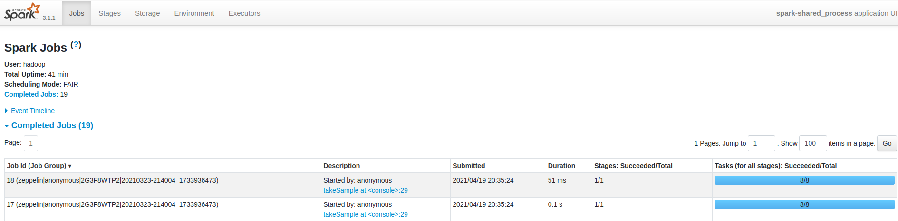
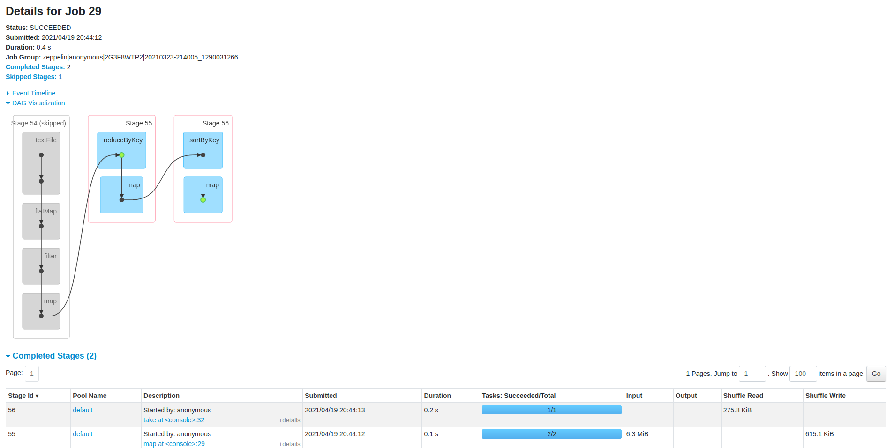

# Assignment 3

In this assignment we were introduced to Zeppelin notebooks and Spark.

## Zeppelin notebooks
Having worked with Jupyter notebooks, it was easy to get used to Zeppelin notebooks. Similar to Jupyter/IPython notebooks, Zeppelin notebooks consist of cells (here called paragraphs, each indicating its nature with a `%md` for markdown and `%spark` for code in the beginning), you can use `shift + enter` to execute the currently focused cell and its output is printed directly after the cell.

## Apache Spark

### Intro
Spark is software that is used to process large datasets. Each process is called a task and tasks can be distributed across multiple machines for parallel processing. Spark allows the usage of a bunch of languages to define and issue tasks, including Python, R, SQL and Java but we will be using Scala in this course.

### RDD
Spark works with **Resilient Distributed Datasets** or **RDD** for short. 
* Resilient because once an RDD has been created it cannot be changed, allowing for its quick reuse directly from memory instead of mass storage  (which makes them faster than map-reduce)
* Distributed because they can be  distributed over multiple computers
* Datasets because they hold data

RDDs can be created using the **Spark Context** object `sc`.
* using an already defined object, such as an array, with the function `parallelize`, 2nd argument is the number of workers
    * `rdd = sc.parallelize(0 to 999, 8)`
* using a file, with the function `textFile`, 2nd argument is again the number of workers
    * `sc.textFile("file",3)`


### Lazy Evaluation
Spark uses lazy evaluation, meaning that execution of functions takes place only when other functions need it.
* for example `val example = sc.parallelize(0 to 999,8)` defines how the variable `example` will be created, but it isn't actually evaluated and stored in memory until it is needed somewhere else, for example by the following line `val sample = example.takeSample(false, 4)` which requires to evaluation of the variable `example` in orderto return samples from it.

### Jobs and stages

Jobs are essentially the queries that users submit when they run a command involving an RDD. Each job is divided into stages, with stages being stored in memory so that if another job requires the same stage it can be swiftly reused without extra computational cost. From the jobs tab you can see stats for each job, such as when it was submitted and how long it took to finish.

Clicking on the job provides us with a more detailed overview, including a directed acyclic graph showing the functions that comprise the job.


### Longest sentence
At first I was overthinking how I need to define the mapper and reducer so that from lines I go to sentences then count number of words in sentence, but then I noticed in the previous paragraph/markdown cell it was mentioned that we assume a line is a sentence. Then the answer becomes pretty easy - we map each sentence to its length (number of characters) and then from each pair of 'sentences' we pick the one with larger number of characters.
```scala
println("Longest sentence : \t", lines.map(s=>s.length).reduce((v_i, v_j) => v_i max v_j))
```
Resulting in our answer:
```
Longest sentence: 78
```

### Proper counting of words
During the previous exercise people (including me) just queried 'Romeo' and 'Juliet' which doesn't take into account signs occuring immediately after their names (`Romeo!` for example ) for example. In order to fix this first all words are mapped to lowercase letters and then a regular expression is used to replace all non-character signs at the beginning and end of a word with the empty string (`""`). The counting that happens afterwards is then is more true than the simple one we made in previous exercise.

### Saving RDD as text file
Once we're done working with an RDD we might want to save it somewhere. This can be done with `example_rdd.saveAsTextFile("file:///some_directory/some_folder")` The result is multiple files, a result of having multiple workers.

### Caching
Due to lazy evaluation two queries that require the same variable might result in the evaluation of that variable twice. This can be avoided by first producing the variable and caching it in memory using `cache()`. This way then the cached variable can be used for both of the queries without the need for evaluating it twice. Alternatively, `persist()` can also be used to save the RDD to a user-defined level of storage.

### Partitioning
RDDs are divided into multiple partitions. There are multiple ways to partition the data, so there are different Partitioners. In part B a hash partitioner is used which then somehow turns into None (meaning, default partitioner). This happened due to the use of a map function, which loses the order of the values and their respective keys, which makes Spark use another partitioner for the resulting RDD, since none is specified, the default partitioner is used (returning None when querying for it). Later mapValues is used instead which preserves the order of the values, allowing to keep the hash  keys as well. When querying for the partitioner then we see that it has preserved the HashPartitioner.

### Repartition vs Coalesce

We might want to alter the number of partitions of an RDD at some point. This can be done with the `.repartition(nrOfNewPartitions)` method, invoked on the RDD. When using this method the RDD is reshuffled and then assigned to new partitions. All prior partitioning data is lost. 
 
If instead we want to keep the order (and save on reshuffling computation) and preserve the previous partitioning's information we can use `.coalesce(nrOfNewPartitions)` This works only when decreasing the amount of partitions, by simply grouping partitions together.
