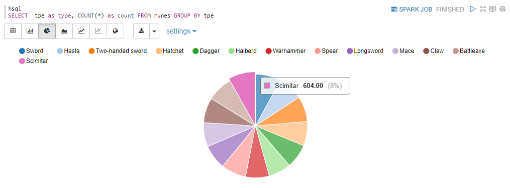

# Assignment 5 - Streams

In this assignment we were introduced to the handling of streaming data using Spark. Streaming data is data the is continuously being received, usually over the internet from source that keeps generating and sending new data. In order to do this we are provided with a python file that generates a data stream that can be access on port 9999 of the localhost address (0.0.0.0). The simulated data is modelled after in game store transactions from the game 'Runescape'. 

## Establishing connection
First we run the python file in order to have a stream of data accessible at a particular internet address.

Then, in our Zeppelin notebook we need to initialize the object that we listen to that address for new data using the code:
```
val socketDF = spark.readStream
  .format("socket")
  .option("host", "192.168.1.47")
  .option("port", 9999)
  .load()
```
Note that for my set up (docker + spark/zeppelin running on my laptop and accessing the WebUI on my desktop), I changed the host to point to my desktop computer (instead of the docker host OS's localhost/0.0.0.0), as running the python file on my desktop PC running Windows instead of going to my laptop (which was all the way next to my bed) was deemed as a work overhead that is not worth the reward.

After initializing the `socketDF` we can check whether connection was established and data is streaming using the function of `.isStreaming` that this object has. Luckily, for me this returned value `True` meaning my weird setup is working properly.

## Creating a DataFrame we can work with
First we need to set the format that we will be recording the stream in using our socketDF object. In this case we are writing to memory.
```
// Setup streamreader
val streamWriterMem = socketDF
  .writeStream
  .outputMode("append")
  .format("memory")
```
Now we have to actually start streaming and say what we want the variable to be called (inside which we record the data)
```
// Start streaming!
val memoryQuery = streamWriterMem  
  .queryName("memoryDF")
  .start()
```
And after we've ran for a while we can stop the stream using:
```
// ... and stop the query, to avoid filling up memory:
memoryQuery
  .stop()
```
In the provided zeppelin notebook this was all in a single cell where waiting was achieved using
```
In this case the
// Run for 1 second...
memoryQuery
  .awaitTermination(1000)
```
But we can instead just start and stop manually leaving however much time we want for data to be accumulated. 

The end result is a DataFrame called `memoryDF` 

# Working with the DataFrame we produced from the stream
Initially the stream is separated into observations using only new lines. This means our DataFrame contains a single dimmension with each item being a line of data.

Here is what it looks like visualized:


If we want to create a DataFrame where this is separated better into more usable values we first have to define a class: 

```
case class RuneData(material: String, tpe: String, price: Integer)
```
* Note that I have added the object `tpe: String` in order to also record the type of the object, not previously present in the excercise.

Then using a regular expression and a query we can extract the parts of each line that are meaningful to us.

Here is the regex to extract the material, type of weapon and price from these lines:

```
"\"^([A-Z].+) ([A-Z].+) was sold for (\\\\d+)\""
              ^       ^  
```
* the brackets under which i put arrows are the ones I added to the regex that was provided by the excercise so that the type of weapon is also extracted (initialy it was only the material and the price)

the query and the extraction:
```
val q = f"select regexp_extract(value, $myregex%s, 1) as material, regexp_extract(value, $myregex%s, 2) as tpe, cast(regexp_extract(value, $myregex%s, 3) as Integer) as price from memoryDF"

val runes = spark.sql(q).as[RuneData]
```

This gives us this nice DataFrame: 


## Writing to the console instead of memory

Instead of memory now we are going to write our output to the console by changing the command we've seen previously:

```
val streamWriterMem = socketDF
  .writeStream
  .outputMode("append")
  .format("memory")
```

to 

```
val rConsoleQuery = runes
  .writeStream
  .outputMode("append")
  .format("console")
```

(and also already start streaming with `.start()`)

While we're streaming we can use 
```
spark.streams.active
```
in order to visualize the batches that have been collected so far, each batch collecting some data.

## Writing to our hard memory

We have to setup a writer that specifically writes to a place in our storage and start it:

```
val streamWriterDisk = runes
  .writeStream
  .outputMode("append")
  .option("checkpointLocation", "file:///tmp/checkpoint")
  .trigger(Trigger.ProcessingTime("2 seconds"))

val stream2disk = streamWriterDisk
  .start("file:///opt/hadoop/share/runedata")
```

Make sure you first create the directory though :) 

When we feel like it we can issue a `.stop()` command using the `stream2disk` object to stop.

## Working with the collected data

Once we have collected data on our hard drive it is trivial to read it as a parquiet file using the command

```
val runes = spark
  .read
  .parquet("file:///opt/hadoop/share/runedata/part-*")
  .createOrReplaceTempView("runes")
```

## Fun with SQL

And now we can have some fun exploring our data. I am not a fan of runescape so I didn't do anything besides the suggested queries.

### How many rune items were sold?

```
%sql
SELECT COUNT(*) AS nrSales FROM runes
``` 
produces result: `7422`

### How many of each item type was sold?
```
%sql
SELECT  tpe as type, COUNT(*) as count FROM runes GROUP BY tpe
```

produces these results:


don't forget you can have some fun with the visualization though! :)



:O this item is called Scimitar and my name is Dimitar... Crazy, right?!

### How much gold was spent buying swords?

```
%sql
SELECT SUM(price) as sum FROM runes WHERE LOWER(tpe) LIKE "%sword%"
```

Produces answer: `22022291` which in my opinion is too much gold for swords and not enough gold for Dimita- i mean Scimitar!